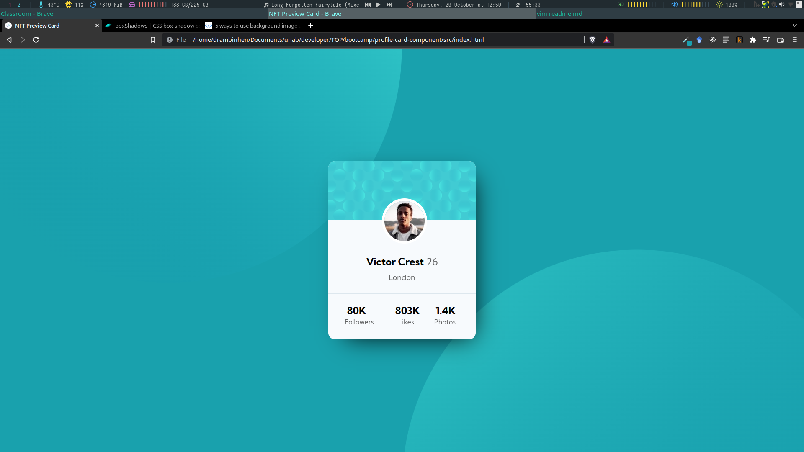
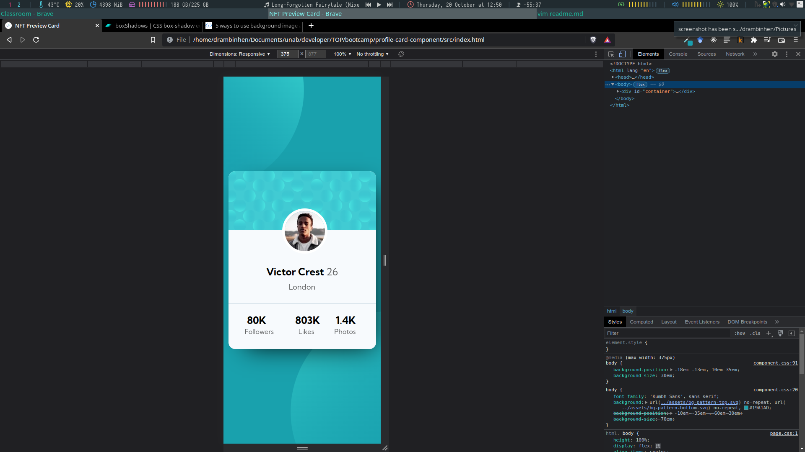

# Make It Real - PROFILE CARD REVIEW

This is a solution to the Profile Card Revier project of the Make It Real course.

## Table of contents

- [Overview](#overview)
  - [The challenge](#the-challenge)
  - [Screenshot](#screenshot)
- [My process](#my-process)
  - [Built with](#built-with)
  - [What I learned](#what-i-learned)
  - [Continued development](#continued-development)
  - [Useful resources](#useful-resources)
- [Author](#author)
- [Acknowledgments](#acknowledgments)

## Overview

### The challenge

Users should be able to:

- Develop mobile design
- Develop desktop design

### Screenshot

## My process

### Built with

- Semantic HTML5 markup
- CSS custom properties
- Flexbox
- Mobile-first workflow

### What I learned

Getting better at CSS, understanding more background property and box-shadow a little.

### Continued development

CSS in general.

### Useful resources

- [Example resource 1](https://frontendresource.com/css-background-image-color/) - This helped me to use background as wanted.
- [Example resource 2](https://boxshadows.com/) - This is a good web to try differents box shadows in an easy way.

## Author

Daniel monsalve

## Acknowledgments

Sorry for no get to attend class today, I have been a little occupied with some problems.

